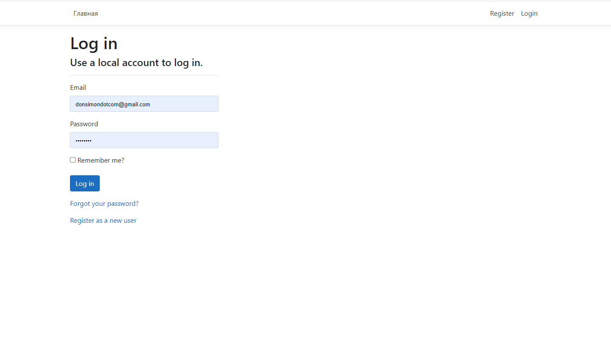
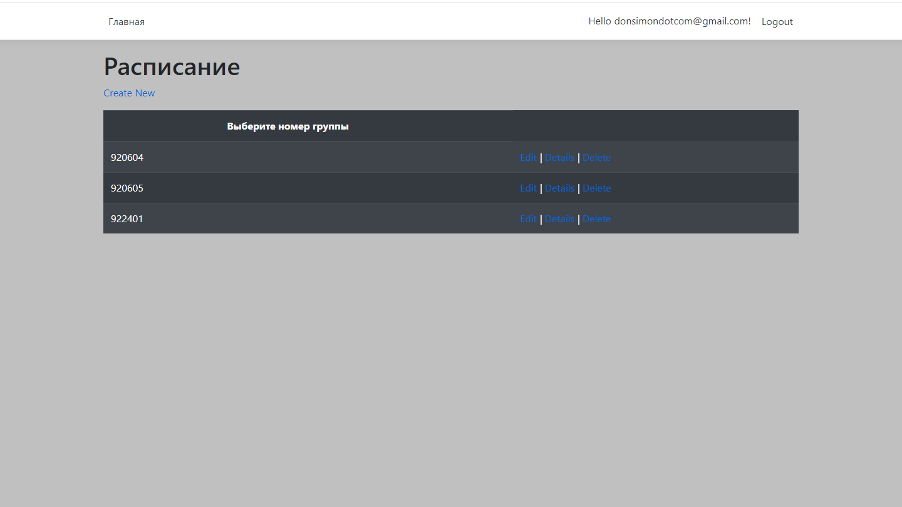
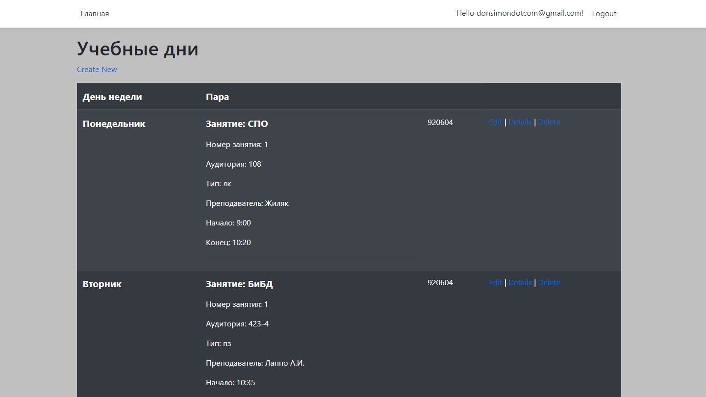

# Timetable
ASP.NET application. Created as a coursework.

Right now app is working on a free temporary hosting: <a href="http://donsimondotcom-001-site1.dtempurl.com/">link</a>.

## Built with
+ Framework: ASP.NET Core
+ Database: T-SQL
+ Architecture - MVC

## Screenshots

____

____

## Addition Feature
An application taken from another github user (<a href="https://github.com/alexzhirkevich/student-bsu-by">link<a/>) has been modified. Now it displays the schedule from this web application. Jsoup parsing was used for this.
